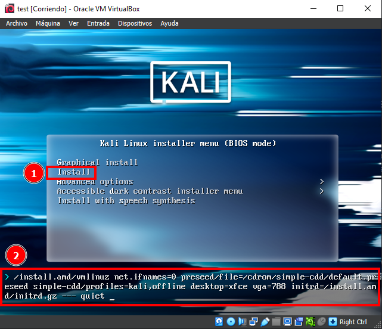
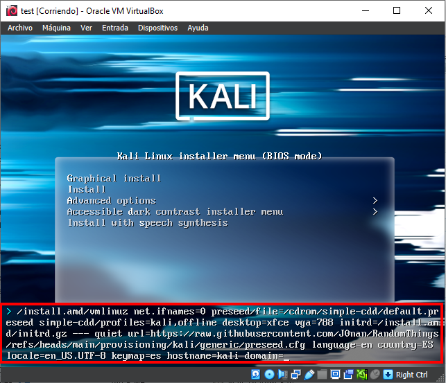

# Kali <!-- omit in toc -->

## Table of Content <!-- omit in toc -->

- [Usage](#usage)
- [What it does](#what-it-does)
  - [Preseed.cfg](#preseedcfg)
  - [PostSeed.sh](#postseedsh)
    - [Configuration](#configuration)
    - [Tools](#tools)
- [Update](#update)

## Usage

This guide is focused in Kali Linux using VirtualBox

1. [Download](https://www.kali.org/get-kali/#kali-installer-images) Kali Linux.
2. Create a new Virtual Machine.
3. Configure the Hardware, I recommend a minimum of 4096 MB of RAM, 3 CPUs processors and 100 GB of Hard Drive (it can be higher, depending on your hardware).
4. Before booting the VM, change the display setting to use at least 32 MB of Video memory in order to be able to rescale on bigger screen and with higher resolutions.
5. Boot the VirtualMachine.
6. Once booted go to Install and press the `Tab` key instead of the `Enter`, this will show a command line at the bottom, as shown in the next picture.

<center>  </center>

7. Once the command line is shown add the following changing the language, country, locale and keymap if needed (if you are not able to copy and paste, you can use any [Pastebin Services](https://github.com/lorien/awesome-pastebins) like <http://vpaste.net/> to copy and paste the content of the preseed.cfg file and type a shorter url instead of the one from Github)

```shell
url=https://raw.githubusercontent.com/J0nan/RandomThings/refs/heads/main/provisioning/kali/generic/preseed.cfg language=en country=ES locale=en_US.UTF-8 keymap=es hostname=kali domain=
```

<center>  </center>

8. After entering the command press `Enter` and wait until Kali is installed.

## What it does

### Preseed.cfg

ToDo

### PostSeed.sh

This script is executed by the installer after performing all the configurations and updating all the packages already install on the OS. The script does some [configuration](#configuration) and install some useful [tools](#tools).

#### Configuration

- Removes the transparency of the terminal.

#### Tools

- python3.12-venv
- golang-go
- docker
- google-android-platform-tools-installer
- [Testssl.sh](https://github.com/drwetter/testssl.sh)
- [Aquatone](https://github.com/firefart/aquatone)
- [ssh-audit](https://github.com/jtesta/ssh-audit)
- [Terrapin-Scanner](https://github.com/RUB-NDS/Terrapin-Scanner)
- [JexBoss](https://github.com/joaomatosf/jexboss)

## Update

Work in progress...
